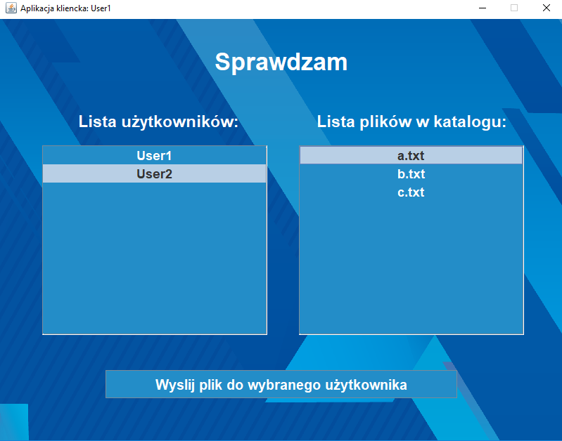
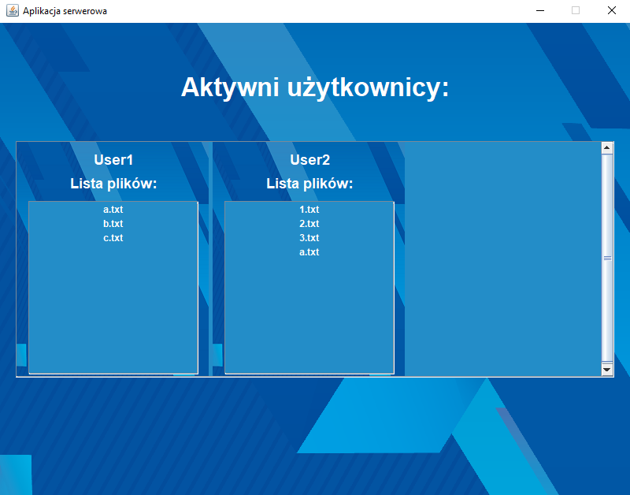

# Aplikacja klient-serwer aktualizująca zawartość katalogu lokalnego oraz zdalnego jej użytkowników

Aplikacja umożliwia użytkownikowi:

* Rejestracje na serwerze
* Automatyczne wysyłanie nowych plików z katalogu lokalnego do katalogu użytkownika na serwerze
* Aktualizacje plików na serwerze, po ich usunięciu z katalogu lokalnego
* Automatyczne wysyłanie nowych plików z katalogu zdalnego do katalogu lokalnego
* Udostępnienie wybranego pliku innemu użytkownikowi zalogowanemu na serwerze

Aplikacja kliencka:

Aplikacja serwerowa:

